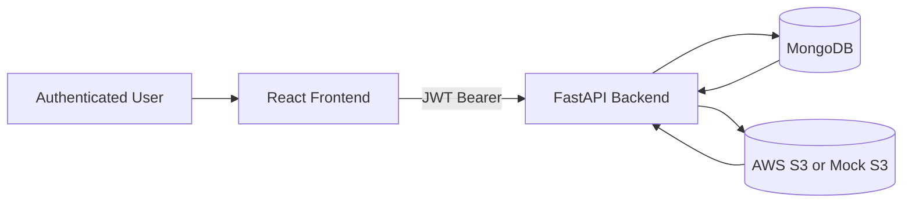

# MediVault

MediVault is a demo-ready secure upload system for medical files with resumable multipart transfer, per-user S3 bucket management, and operational dashboards.

## What It Solves

MediVault is designed for large-file workflows where reliability and traceability matter.

- React frontend for upload UX, dashboard views, and history.
- FastAPI backend for auth, upload orchestration, and signed URL handling.
- MongoDB for users, upload sessions, upload history, and bucket metadata.
- AWS S3 for file storage (or mock S3 mode for local testing).

## System At A Glance



## Tech Stack

- Frontend: React, Vite, Axios, TailwindCSS
- Backend: FastAPI, Pydantic, PyMongo, boto3, slowapi
- Data store: MongoDB
- Object storage: AWS S3 multipart upload + presigned URLs

## Core Capabilities

- JWT authentication with session-scoped browser login state.
- Chunked multipart upload with pause, resume, retry, and abort.
- Strict bucket-session matching to avoid cross-bucket upload mistakes.
- Per-user bucket credential vault with encrypted secret storage.
- Bucket metadata management (display name, region, size limit, KMS, notes).
- Upload history and bucket usage analytics.
- Background cleanup for expired in-progress multipart sessions.
- Demo-polish error handling with guided recovery and clear failure reason labels.

## Repository Layout

```text
medivault/
├── README.md
├── CONTRIBUTING.md
├── CHANGELOG.md
├── LICENSE
├── .env.example
├── docker-compose.yml
├── docs/
│   ├── ARCHITECTURE.md
│   ├── API.md
│   ├── SECURITY.md
│   ├── DEPLOYMENT.md
│   ├── DATA_MODEL.md
│   ├── TESTING.md
│   ├── TROUBLESHOOTING.md
│   └── GLOSSARY.md
├── frontend/
└── backend/
```

## Quick Start

### 1. Prerequisites

- Node.js 20+
- Python 3.11+
- Docker + Docker Compose

### 2. Clone and Install

```bash
git clone <repo-url>
cd package-system

cd frontend && npm install
cd ../backend
python -m venv .venv
source .venv/bin/activate
pip install -r requirements.txt
cd ..
```

### 3. Environment Variables

Create a root `.env` file (recommended for this repo) using `.env.example` as a template.

```bash
cp .env.example .env
```

Required backend variables:

- `MONGO_URI`
- `MONGO_DB_NAME`
- `JWT_SECRET_KEY`
- `JWT_ALGORITHM`
- `ACCESS_TOKEN_EXPIRE_MINUTES`
- `CORS_ALLOW_ORIGINS`
- `ENCRYPTION_KEY`
- `PRESIGNED_URL_EXPIRY`
- `UPLOAD_CLEANUP_INTERVAL_SECONDS`

Optional backend variables:

- `USE_MOCK_S3`
- `MOCK_S3_STATE_FILE`
- `MOCK_S3_PART_FAILURE_RATE`
- Legacy fallbacks (`AWS_ACCESS_KEY_ID`, `AWS_SECRET_ACCESS_KEY`, `AWS_REGION`, `S3_BUCKET_NAME`, `KMS_KEY_ID`)

Frontend optional variables:

- `VITE_API_AUTH_BASE` (default `/api/auth`)
- `VITE_API_UPLOAD_BASE` (default `/api/upload`)

Generate a valid encryption key:

```bash
python -c "from cryptography.fernet import Fernet; print(Fernet.generate_key().decode())"
```

### 4. Start MongoDB

```bash
docker compose up -d mongo
```

### 5. Run Backend

```bash
cd backend
source .venv/bin/activate
uvicorn app.main:app --reload
```

Backend health check:

```bash
curl http://127.0.0.1:8000/health
```

### 6. Run Frontend

In a second terminal:

```bash
cd frontend
npm run dev
```

Frontend URL: http://localhost:5173

### 7. Access App

- Frontend: http://localhost:5173
- Backend health: http://127.0.0.1:8000/health

## AWS Credentials and Bucket Setup

Use the app Settings flow to add bucket credentials per user.

- Provide AWS access key, secret key, region, and bucket name.
- Bucket validation runs during save.
- Upload target bucket must be selected before upload.

## Upload Error UX (Demo Polish)

The upload panel now includes:

- clear error reason labels (network/auth/validation/size/file type/partial chunk failure)
- inline guidance text for next action
- retry action for recoverable failures
- abort action for stuck or partial sessions

## Seed Data

Use the Python seed script to create demo users and upload history.

```bash
cd backend
source .venv/bin/activate
python scripts/seed_demo_data.py
```

Reset and reseed:

```bash
python scripts/seed_demo_data.py --reset
```

Default seeded users:

- `doctor.demo` / `DemoPass123!`
- `patient.demo` / `DemoPass123!`

## How To Test Upload System

### 1. Upload Error States

- Network failure:
  - Start an upload, disable network in browser dev tools, confirm error reason and retry path.
- Backend failure:
  - Stop backend during upload or force invalid bucket session, confirm clear error message.
- Size/type validation:
  - Upload unsupported type or over-limit file, confirm specific reason and guidance text.
- Partial upload failure:
  - Interrupt upload mid-way and confirm partial failure guidance plus retry/abort options.

### 2. Seed Data

- Run `python scripts/seed_demo_data.py`.
- Log in as seeded user.
- Confirm dashboard/upload history contains sample records.

### 3. End-to-End Smoke Test

- Login -> select bucket -> upload file -> verify completion.
- Refresh page and verify history persists.

## Demo Walkthrough

1. Login as `doctor.demo`.
2. Open Settings and verify at least one upload bucket is configured.
3. Go to Upload Center and choose a target bucket.
4. Upload a sample file (or folder) and show pause/resume.
5. Trigger an error (network off), show reason label and retry.
6. Open dashboard metrics and upload history.
7. Log out and log in as `patient.demo` to show per-user isolation.

## Docs Index

- Architecture: docs/ARCHITECTURE.md
- API: docs/API.md
- Security: docs/SECURITY.md
- Deployment: docs/DEPLOYMENT.md
- Data model: docs/DATA_MODEL.md
- Testing: docs/TESTING.md
- Troubleshooting: docs/TROUBLESHOOTING.md
- Glossary: docs/GLOSSARY.md

## Current Notes

- Upload target bucket selection is mandatory before upload actions.
- Auth token is stored in session storage (tab/window close logs out).
- `docker-compose.yml` currently provisions MongoDB service only.
